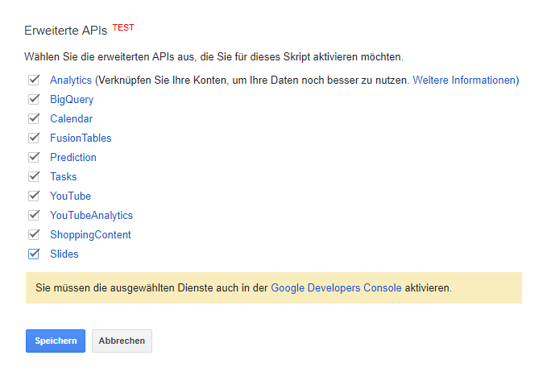
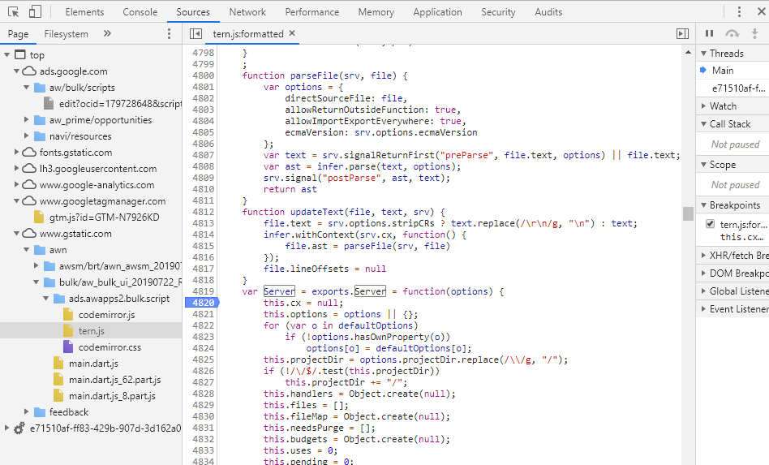
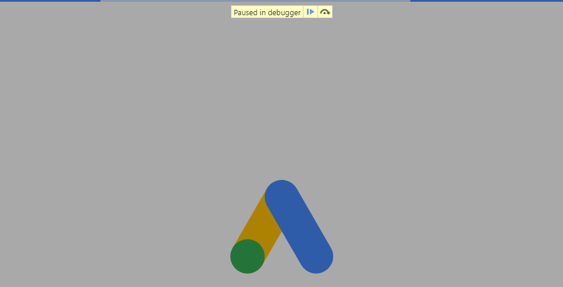
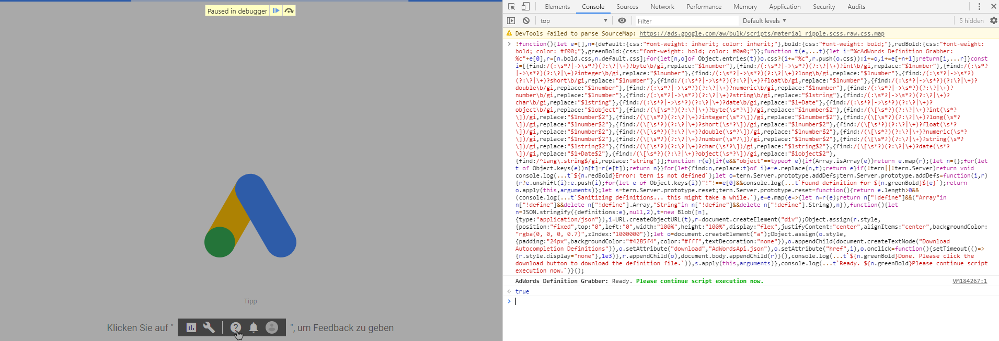
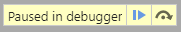
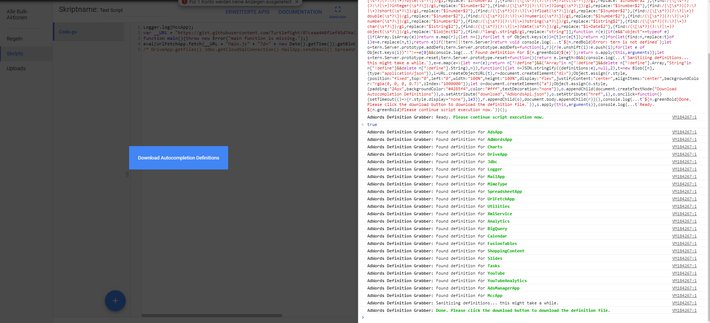

# AdScriptor Api Converter
Converts the Google AdWords API Autocompletion Files to a single JSON Type Definition File, that the ACE Editor understands.

You only need to use this tool if you want to refresh the AdWords Scripts API Autocompletion in AdScriptor.
We (crealytics) normally do this periodically, and commit the latest autocompletion file to the repository.

### How to use
1.  Open Google Chrome and go the AdWords Scripts Page in Google AdWords.
2.  Create a new AdWords Script and click on "Advanced APIs" on the Script Editing Page.
3.  Select all available APIs, confirm the Dialog Message.  
    
4.  Open the Developer Tools Console (press F12) and go to the "Sources" tab.
5.  Find the `tern.js` file, pretty-print it (click on the `{}` in the bottom left corner) and search for `exports.Server`.
    Set a breakpoint on the first line of this function.  
    
6.  Reload the page and wait until the debugging breakpoint triggers.  
    
7.  Go to the "Console" tab in Developer Tools and copy-paste the contents from [`grabDefinitions.min.js`](grabDefinitions.min.js).
    Then hit Enter. You should get a message telling you to un-pause the debugger.  
    
8.  Click the blue play button in the "Paused in debugger" popup to allow the site to load.  
    
9.  Wait until the site is loaded and the "Download Autocompletion Definitions" button appears.  
    
10. Download the definitions by clicking on the button.
11. Copy the json file you downloaded to `res/AdWordsApi.json` in the repository root.
12. Done! You successfully updated the Autocompletion for AdScriptor! 
    Now you just need to verify that there are no errors in the file by trying out the autocompletion in your browser.

