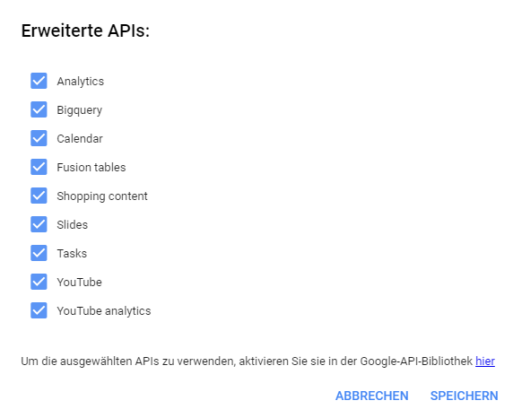

# AdScriptor Api Converter
Converts the Google AdWords API Autocompletion Files to a single JSON Type Definition File, that the ACE Editor understands.

You only need to use this tool if you want to refresh the AdWords Scripts API Autocompletion in AdScriptor.
We (crealytics) normally do this periodically, and commit the latest autocompletion file to the repository.

### How to use
1.  Open your Browser and go the AdWords Scripts Page in Google AdWords.
2.  Create a new AdWords Script and click on "Advanced APIs" on the Script Editing Page.
3.  Select all available APIs, confirm the Dialog Message and reload the Page.
    
4.  Open the `ConvertToJson.html` page (from this repository) in a new tab.
5.  Find the `resources.js` request sent by the page in your browser and copy the response body.
    
6.  Paste the Response Body in the upper textarea of the ConvertToJson.html page.
7.  Copy the converted JSON in the lower textarea and save it as `api-responses/resources.json`.
    
8.  After that you need to download and convert all urls in the `resources.json` file: 
    Example: `"DataTable": "https://docs.google.com/macros/autocomplete/static/2686458239-DataTable-Api.js"`
    1. Download the file from the url with your browser.
    2. Put the content of the file into the upper textarea of the ConvertToJson.html page.
    3. Copy the content of the lower textarea and save it as `api-responses/API_NAME.json` 
       (The file name would be `api-responses/DataTable.json` in this example)
    4. Repeat Step 1.-3. for all entries in the `resources.json` file.

    After that you should have the following files in the `api-responses` folder: 
    
9.  Because some google api docs are randomly obfuscated, you need to fix the replacements in `conv-completion.php`
    to match the API names in the `api-responses/*.json` files. This is especially important for the `AdWordsApp.json` and the `MccApp.json`. 
    This is the replacement list: 
     
    For `MccApp.json` and `AdWordsApi.json` you need to add the value stored at "1" -> "1" to be replaced by the real app name. 
    Example `MccApp.json`: 
    
10. Run the conversion script with `php conv-completion.php`. 
    Watch out for any errors / warnings you see. 
    The warning `Warning: Type 'X' could be a simple type...` can be safely ignored.
11. Copy the output json file from `output/YY-MM-DD hh-mm-ss AdWordsApi.json` to `res/AdWordsApi.json` in the repository root.
12. Done! You successfully updated the Autocompletion for AdScriptor! 
    Now you just need to verify that there are no errors in the file by trying out the autocompletion in your browser.
